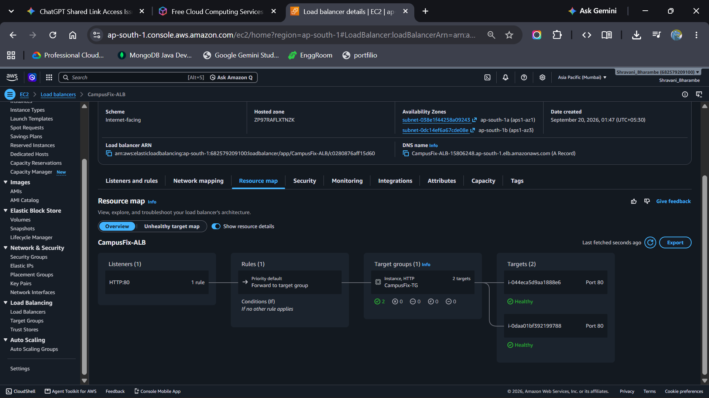
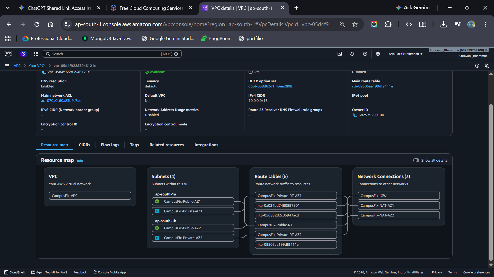
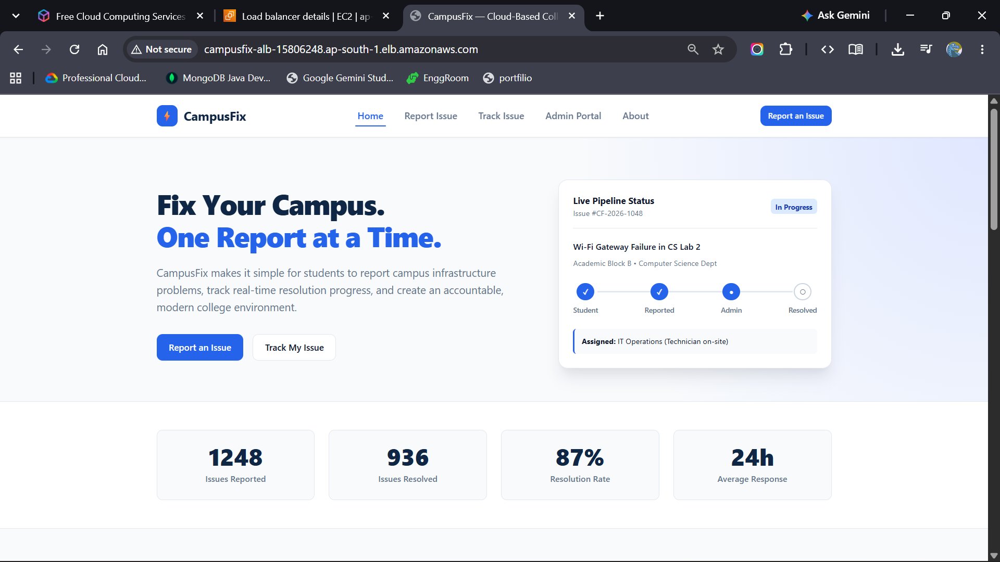

# CampusFix — Cloud-Based College Issue Reporting System

CampusFix is a centralized college issue reporting platform that allows students to report campus-related issues (electrical, infrastructure, network, water supply) and track resolution progress in real time. 

Originally created as an issue ticketing portal, this project was redesigned and deployed on **Amazon Web Services (AWS)** to demonstrate a resilient, highly available, multi-Availability Zone enterprise infrastructure.

---

## ☁️ Cloud & Network Architecture

The application is deployed across two Availability Zones in the `ap-south-1` (Mumbai) region, isolating compute workloads from direct public internet exposure while maintaining high availability and auto-recovery.

```text
                                INTERNET
                                   │
                                   ▼
                         ┌───────────────────┐
                         │  Internet Gateway │
                         └─────────┬─────────┘
                                   │
                         ┌─────────▼─────────┐
                         │  Application Load │
                         │     Balancer      │
                         └───────┬───┬───────┘
                                 │   │
                ┌────────────────┘   └────────────────┐
                ▼                                     ▼
     ┌──────────────────────┐              ┌──────────────────────┐
     │  Public Subnet AZ-1  │              │  Public Subnet AZ-2  │
     │     10.0.1.0/24      │              │     10.0.2.0/24      │
     │                      │              │                      │
     │    NAT Gateway 1     │              │    NAT Gateway 2     │
     └──────────┬───────────┘              └──────────┬───────────┘
                │                                     │
                ▼                                     ▼
     ┌──────────────────────┐              ┌──────────────────────┐
     │  Private Subnet AZ-1 │              │  Private Subnet AZ-2 │
     │     10.0.3.0/24      │              │     10.0.4.0/24      │
     │                      │              │                      │
     │   EC2 (Nginx App)    │              │   EC2 (Nginx App)    │
     └──────────┬───────────┘              └──────────┬───────────┘
                │                                     │
                └──────────────────┬──────────────────┘
                                   │
                         ┌─────────▼─────────┐
                         │ Auto Scaling Group│
                         └───────────────────┘
```

---

## 🏗️ AWS Infrastructure & Network Topology

### VPC Configuration
| Property | Specification |
| :--- | :--- |
| **VPC Name** | `CampusFix-VPC` |
| **IPv4 CIDR Block** | `10.0.0.0/16` |
| **Region** | `ap-south-1` (Mumbai) |
| **Availability Zones** | 2 (`ap-south-1a`, `ap-south-1b`) |

### Subnet Layout
| Subnet Name | Availability Zone | CIDR Block | Type | Deployed Resources |
| :--- | :--- | :--- | :--- | :--- |
| `CampusFix-Public-AZ1` | `ap-south-1a` | `10.0.1.0/24` | Public | ALB Node, NAT Gateway 1 |
| `CampusFix-Public-AZ2` | `ap-south-1b` | `10.0.2.0/24` | Public | ALB Node, NAT Gateway 2 |
| `CampusFix-Private-AZ1` | `ap-south-1a` | `10.0.3.0/24` | Private | EC2 App Instance (Nginx) |
| `CampusFix-Private-AZ2` | `ap-south-1b` | `10.0.4.0/24` | Private | EC2 App Instance (Nginx) |

---

## 🛡️ Routing & Security Design

### Route Tables
* **Public Route Table (`CampusFix-Public-RT`):**
  * `10.0.0.0/16` → `local`
  * `0.0.0.0/0` → `Internet Gateway (IGW)`
* **Private Route Tables (`CampusFix-Private-RT-AZ1` & `AZ2`):**
  * `10.0.0.0/16` → `local`
  * `0.0.0.0/0` → Dedicated AZ NAT Gateway (`nat-az1` / `nat-az2`)
  * *Prevents cross-AZ failure dependency while enabling secure outbound package fetching.*

### Security Groups (Principle of Least Privilege)
* **`CampusFix-ALB-SG` (Public Ingress):**
  * Inbound: HTTP (80) & HTTPS (443) from `0.0.0.0/0`
  * Outbound: All traffic
* **`CampusFix-EC2-SG` (Compute Isolation):**
  * Inbound: HTTP (80) **strictly restricted** to the source SG `CampusFix-ALB-SG`
  * Outbound: All traffic via NAT for package updates
  * *Zero direct public access from the internet to the EC2 instances.*

---

## ⚙️ Automated Provisioning & High Availability

### Launch Template & User Data Automation
EC2 instances are launched automatically using an EC2 Launch Template (`CampusFix-Launch-Template`) executing the following bootstrap script on initialization:

```bash
#!/bin/bash
apt-get update -y
apt-get install -y nginx git
rm -rf /var/www/html/*
git clone [https://github.com/shravanibharambe/CampusFix.git](https://github.com/shravanibharambe/CampusFix.git) /tmp/CampusFix
cp -r /tmp/CampusFix/* /var/www/html/
chown -R www-data:www-data /var/www/html
systemctl enable nginx
systemctl restart nginx
```

### Application Load Balancer & Target Group
* **Target Group (`CampusFix-TG`):** Configured to execute automated health checks over `HTTP:80` on path `/` expecting HTTP `200 OK`.
* **Traffic Balancing:** The internet-facing ALB distributes client sessions across instances in both AZs, automatically routing traffic away from failed or degrading nodes.

### Auto Scaling Group (`CampusFix-ASG`)
* **Capacity:** Desired: `2`, Min: `2`, Max: `4`
* **Multi-AZ Distribution:** Distributes instances evenly between `CampusFix-Private-AZ1` and `CampusFix-Private-AZ2`.
* **Self-Healing:** Automatically terminates and launches replacement instances if ALB health checks fail.

---

## 📸 Deployment & Verification Screenshots

### 1. Target Group Health Checks Passed
Both EC2 instances running in private subnets passing health checks:


### 2. VPC & Subnet Layout
Custom VPC topology spanning dual Availability Zones:


### 3. Application Deployed & Accessible via ALB DNS
CampusFix live web interface routed via the internet-facing load balancer:


---

## 💻 Application Features

* **Student Portal:**
  * Categorized issue submission (Electrical, Infrastructure, Sanitation, Network).
  * Unique reference code generation for submitted requests.
  * Real-time ticket tracking dashboard.
* **Admin Dashboard:**
  * Filter, search, and update status of pending or resolved issues.
  * Internal operations management for campus maintenance teams.

---

## 🛠️ Technology Stack

* **Cloud Infrastructure:** AWS (VPC, Subnets, Route Tables, Internet Gateway, NAT Gateway, Application Load Balancer, Target Groups, Launch Templates, Auto Scaling)
* **Web Server & OS:** Ubuntu Server LTS, Nginx
* **Frontend:** HTML5, CSS3, JavaScript
* **Version Control:** Git, GitHub

---

## 👩‍💻 Author

**Shravani Bharambe**  
*Computer Science Student | Cloud & DevOps Enthusiast*  
* GitHub: [@shravanibharambe](https://github.com/shravanibharambe)
